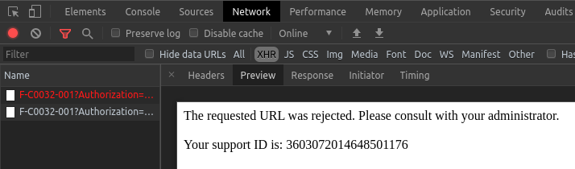

# 今明36小時天氣預報

這只是某堂課的期末作業。  

### 核心要求
- 必須
  - 讀取 JSON 格式檔
  - 引入其它片段檔（至少六個）
- 可選  
  - 使用 AngularJS

其餘不拘，因此界面以簡潔為主。

### 原始資料來源
- [政府資料開放平台：一般天氣預報-今明36小時天氣預報](https://data.gov.tw/dataset/6069)

### 原始資料備註
- [參考文件](https://opendata.cwb.gov.tw/opendatadoc/MFC/ForecastElement.pdf)

### 使用框架
- ~~Vanilla.js~~

### 備註
原始資料使用 fetch 取得時會遇到 CSP 與 CORS 等問題，逐一排除後又會遇到 Request Rejected 的狀況。  
基於經驗不足，只好尋求替代方案，改用 curl 存檔後再交由網頁處理。

關於 Request Rejected 的錯誤截圖：

~~目前使用 GitHub Action 達到每天 12, 18 時自動更新天氣預報資料。~~  

已將排程修改成每年一月一日才會更新（幾乎是關閉更新）  

